# VSDSquadron FPGA Mini Internship - Task 1 Submission

## Setting up GitHub Codespace

>Fork the `vsd-riscv2` repository and create a GitHub codespace

**Steps:**
1. Fork the repository - https://github.com/vsdip/vsd-riscv2
2. Launch the GitHub Codespace and build it successfully.

**Glimpse of Codespace:**
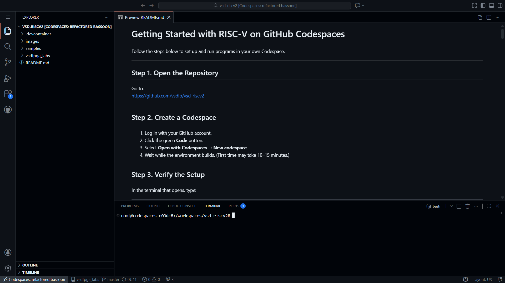
___
## Verifying RISC-V Reference Flow

>Build and run the provided fundamental RISC-V programs, and observe successful execution on console 

**Steps:**
1. Verify the setup.
2. Run the provided programs using RISC-V GCC and Spike.
3. Test the working of RISC-V GCC, Spike and Iverilog using custom programs.

### Setup Verification
**Commands:**
```bash
riscv64-unknown-elf-gcc --version
spike -h
iverilog -V
```

**Outputs:**

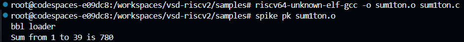
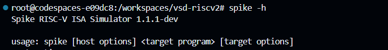
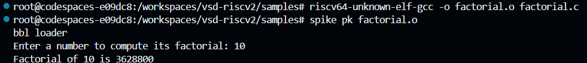


### Program 1 : `sum1ton.c`
**Commands:**
```bash
# Navigate to 'samples' directory
cd samples 
# Compile the program
riscv64-unknown-elf-gcc -o sum1ton.o sum1ton.c
# Load and execute the program
spike pk sum1ton.o
```

**Output:**


### Program 2 : `1ton_custom.c`
**Commands:**
```bash
# Compile the program and link with assembly code
riscv64-unknown-elf-gcc -o 1ton_custom.o 1ton_custom.c load.S
# Load and execute the program
spike pk 1ton_custom.o
```

**Output:**


### Custom Program : `factorial.c`
**Commands:**
```bash
riscv64-unknown-elf-gcc -o factorial.o factorial.c
spike pk factorial.o
```

**Output:**


### Verilog Program : `adder.v` (with testbench `tb.v`)
**Commands:**
```bash
# Compile the Verilog program
iverilog -o adder adder.v tb.v
# Simulate the testbench
vvp adder
```

**Output:**


___
## Verifying the Working of GUI Desktop (noVNC)

>Build and run programs using Native GCC and RISC-V GCC on noVNC desktop

**Steps:**
1. Launch the noVNC Desktop by clicking on the Forwarded Address Link for port `noVNC Desktop 6080` in `PORTS` tab.
2. Click on `vnc_lite.html` in the new browser tab that opens after Step 1. 
3. Open the terminal in noVNC desktop.
4. Compare the native and RISC-V compilers by running a program using both.

### Glimpse of Desktop
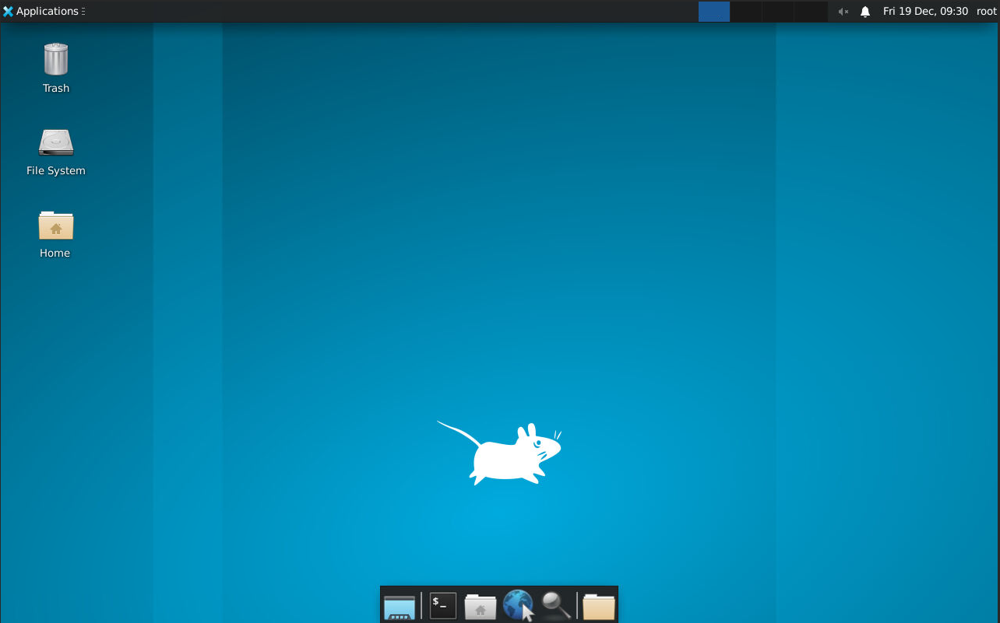

### Run Program using Native GCC
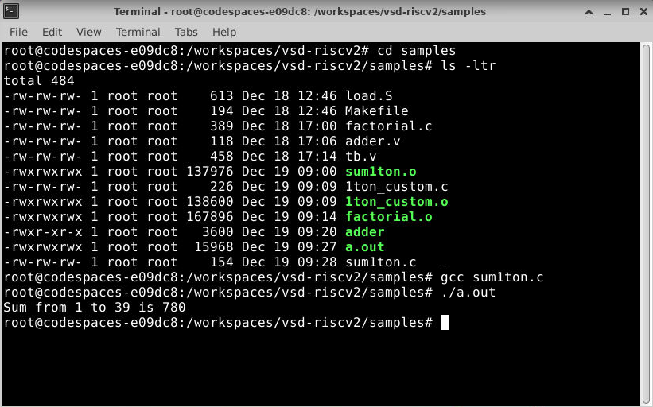

### Run Program using RISC-V GCC and Spike
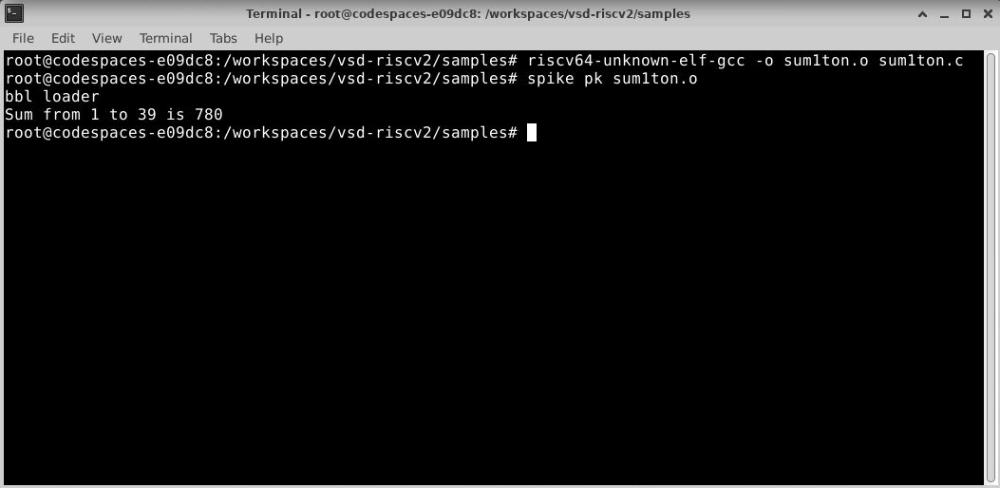
___
## Clone and Build the VSDFPGA Labs

>Build and run the basic labs that do not require FPGA hardware

**Steps:**
1. Install the prerequisites i.e., general dependencies, FPGA toolchain & RISC-V toolchain.
2. Clone the repository https://github.com/vsdip/vsdfpga_labs inside the current repository.
3. Build the firmware and FPGA bitstream.

### Prerequisites installation
**Commands:**
```bash
# General dependencies
sudo apt-get install git vim autoconf automake autotools-dev curl libmpc-dev \
libmpfr-dev libgmp-dev gawk build-essential bison flex texinfo gperf libtool \
patchutils bc zlib1g-dev libexpat1-dev gtkwave picocom -y

# FPGA toolchain (Yosys/NextPNR/IceStorm)
sudo apt-get install yosys nextpnr-ice40 fpga-icestorm iverilog -y

# RISC-V Toolchain (GCC 8.3.0)
cd ~
mkdir -p riscv_toolchain && cd riscv_toolchain
wget "https://static.dev.sifive.com/dev-tools/riscv64-unknown-elf-gcc-8.3.0-2019.08.0-x86_64-linux-ubuntu14.tar.gz"
tar -xvzf riscv64-unknown-elf-gcc-*.tar.gz
echo 'export PATH=$HOME/riscv_toolchain/riscv64-unknown-elf-gcc-8.3.0-2019.08.0-x86_64-linux-ubuntu14/bin:$PATH' >> ~/.bashrc
source ~/.bashrc
```

### Cloning the repository 
**Commands:**
```bash
git clone https://github.com/vsdip/vsdfpga_labs
```

**Verification of successful cloning:**
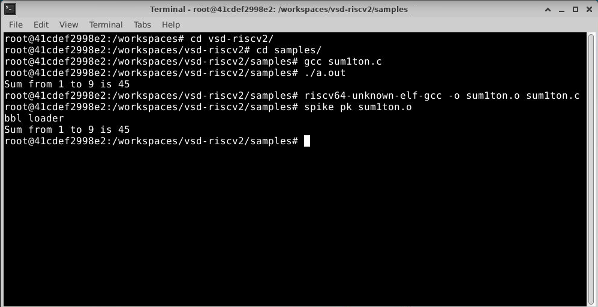

### Building the Firmware and FPGA bitstream 
#### **Reviewing RISC-V Logo code :**
**Commands:**
```bash
cd vsdfpga_labs/basicRISCV/Firmware
nano riscv_logo.c  # Review and close (Ctrl+X)
make riscv_logo.bram.hex
```

**Output:**
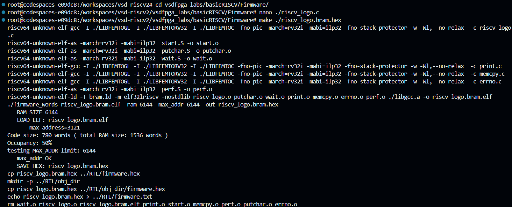

#### **Build Firmware and FPGA bitstream :**
**Commands:**
```bash
cd ../RTL
make clean
sed -i 's/-abc9 -device u -dsp //g' Makefile
make build
```

**Output:**

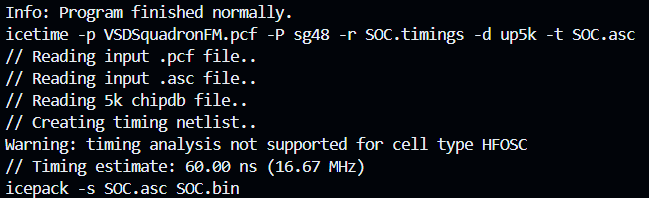
___
## Local Machine Preparation

>Perform the same setup as GitHub Codespaces on Local Machine (Alma Linux 8)

**Steps:**
1. Install RISC-V Toolchain & build Spike ISA Simulator and RISC-V Proxy Kernel.
2. Clone the `vsd-riscv2` and `vsdfpga_labs` repositories in a parent directory.
3. Test the RISC-V toolchain by compiling and running a program.
4. Setup and verify the working of FPGA toolchain.

### RISC-V Toolchain Installation
**Commands:**
```bash
# Install EPEL and enable PowerTools to find development libraries
sudo dnf install -y epel-release
sudo dnf config-manager --set-enabled powertools # On some versions: --set-enabled crb

# Install core dependencies
sudo dnf groupinstall -y "Development Tools"
sudo dnf install -y \
    git curl wget vim gcc-c++ make pkgconfig \
    autoconf automake libtool bison flex \
    gperf texinfo help2man gawk \
    libmpc-devel mpfr-devel gmp-devel \
    zlib-devel expat-devel dtc libfdt-devel \
    python3 python3-pip ncurses-devel readline-devel \
    boost-devel cairo-devel fontconfig-devel \
    libX11-devel libXext-devel libXrender-devel libXpm-devel libXaw-devel

# Install RISC-V Toolchain
sudo mkdir -p /opt/riscv
sudo chown $USER:$USER /opt/riscv
cd /tmp
wget -q https://static.dev.sifive.com/dev-tools/riscv64-unknown-elf-gcc-8.3.0-2019.08.0-x86_64-linux-ubuntu14.tar.gz
tar -xzf riscv64-unknown-elf-gcc-8.3.0-2019.08.0-x86_64-linux-ubuntu14.tar.gz
mv riscv64-unknown-elf-gcc-8.3.0-2019.08.0-x86_64-linux-ubuntu14/* /opt/riscv/
rm -rf riscv64-unknown-elf-gcc-8.3.0-2019.08.0-x86_64-linux-ubuntu14.tar.gz

# Build Spike
git clone --depth 1 https://github.com/riscv-software-src/riscv-isa-sim.git
cd riscv-isa-sim
mkdir build && cd build
../configure --prefix=/opt/riscv
make -j$(nproc)
sudo make install
cd /tmp && rm -rf riscv-isa-sim

# Build RISC-V Proxy Kernel
git clone https://github.com/riscv-software-src/riscv-pk.git
cd riscv-pk
git checkout v1.0.0
mkdir build && cd build
export PATH="/opt/riscv/bin:$PATH"
../configure --prefix=/opt/riscv --host=riscv64-unknown-elf
make -j$(nproc)
sudo make install
cd /tmp && rm -rf riscv-pk

# Add RISC-V tools and Spike to .bashrc
echo 'export PATH="$PATH:/opt/riscv/bin:/opt/riscv/riscv64-unknown-elf/bin"' >> ~/.bashrc
source ~/.bashrc
```

### Cloning the repositories 
**Commands:**
```bash
git clone https://github.com/vsdip/vsd-riscv2
git clone https://github.com/vsdip/vsdfpga_labs
```

### Testing RISC-V Toolchain
**RISC-V GCC Commands:**
```bash
cd vsd-riscv2/samples/
riscv64-unknown-elf-gcc -o sum1ton.o sum1ton.c
spike pk sum1ton.o
```

**Output:**
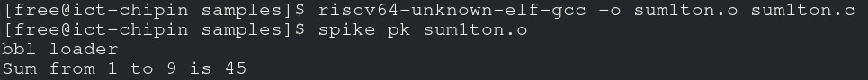

**Native GCC Commands:**
```bash
gcc sum1ton.c
./a.out
```

**Output:**

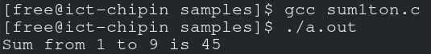

### FPGA Toolchain Installation and Testing 
**Installation Commands:**
```bash
# Install General Dependencies
sudo dnf install -y patch bc gtkwave picocom minicom libftdi-devel libftdi

# Use OSS CAD Suite to install FPGA toolchain (Yosys, NextPNR, Icestorm)
cd ~
wget https://github.com/YosysHQ/oss-cad-suite-build/releases/download/2024-01-01/oss-cad-suite-linux-x64-20240101.tgz
tar -xvzf oss-cad-suite-linux-x64-*.tgz
echo 'export PATH=$HOME/oss-cad-suite/bin:$PATH' >> ~/.bashrc

# Install `iceprog`
cd /tmp
git clone https://github.com/YosysHQ/icestorm.git
cd icestorm
make -j$(nproc)
sudo make install

# Configure USB Permissions
cd /etc/udev/rules.d
touch 53-lattice-ftdi.rules
echo 'ATTRS{idVendor}=="0403", ATTRS{idProduct}=="6010", MODE="0666", GROUP="plugdev", TAG+="uaccess"' >> 53-lattice-ftdi.rules
echo 'ATTRS{idVendor}=="0403", ATTRS{idProduct}=="6014", MODE="0666", GROUP="plugdev", TAG+="uaccess"' >> 53-lattice-ftdi.rules
sudo udevadm control --reload-rules && sudo udevadm trigger
```

**Build and Flash Commands:**
```bash
# Build the Firmware and FPGA Bitstream
cd vsdfpga_labs/basicRISCV/Firmware
make riscv_logo.bram.hex
cd ../RTL
make clean
sed -i 's/-abc9 -device u -dsp //g' Makefile
make build

# Flash to FPGA
make flash

# Run the program
make terminal
```

**Firmware Build Output:**
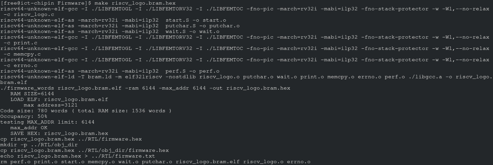

**Flash Verification:**

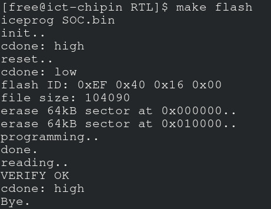

**Glance of FPGA:**

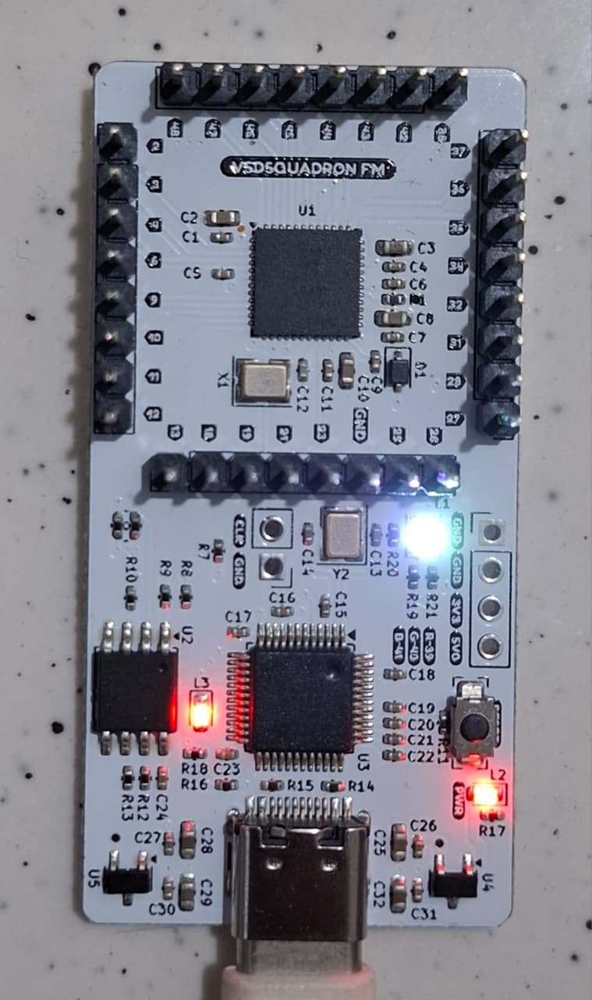
___
## Understanding Check

>**1. Where is the RISC-V program located in the vsd-riscv2 repository?**

- The RISC-V source programs are located in the **`samples`** folder.
- Specific files include **`sum1ton.c`** (C code), **`load.S`** (Assembly code), and **`1ton_custom.c`** (C code). 
- To access them in the environment, we navigate using the command: `cd samples`.


>**2. How is the program compiled and loaded into memory?**

- The GNU Toolchain is used for compilation and the Spike simulator is used for loading and execution:
- **Compilation:** The C program is compiled using the *GCC cross-compiler*.
    - Command: `riscv64-unknown-elf-gcc -o <output_name>.o <input_file>.c`.
    - This creates an ELF object file (e.g., `sum1ton.o`).
    
- **Loading:** The program is loaded and executed using the *Spike ISA Simulator* combined with the *Proxy Kernel (pk)*.    
    - Command: `spike pk <output_name>.o`.
    - The Proxy Kernel (`pk`) serves as a lightweight bootloader/OS that loads the ELF file into the simulated memory and handles system calls.


>**3. How does the RISC-V core access memory and memory-mapped IO?**

- The RISC-V architecture uses a *Load/Store architecture* for all memory accesses:
	- **Memory Access:** The core moves data between memory and registers using dedicated instructions like `lw` (load word) and `sw` (store word). It cannot perform arithmetic operations directly on memory addresses; data must first be loaded into a register.
    
	- **Memory-Mapped I/O (MMIO):** RISC-V does not have special "IN" or "OUT" instructions for Input/Output. Instead, I/O devices (like an IP block) are assigned specific addresses in the main memory map. The core communicates with these devices by reading from and writing to these specific memory addresses using the same standard load/store instructions.


>**4. Where would a new FPGA IP block logically integrate in this system?**

- A new FPGA IP block would logically integrate onto the *System Bus* (interconnect). The IP block connects to the bus that links the RISC-V core to memory and other peripherals. To the software (like the C programs in `samples`), the IP block appears as a set of registers at a specific base address. The driver code would define a pointer to this address (e.g., `#define IP_BASE 0x10000000`) and read/write to it to control the hardware.
